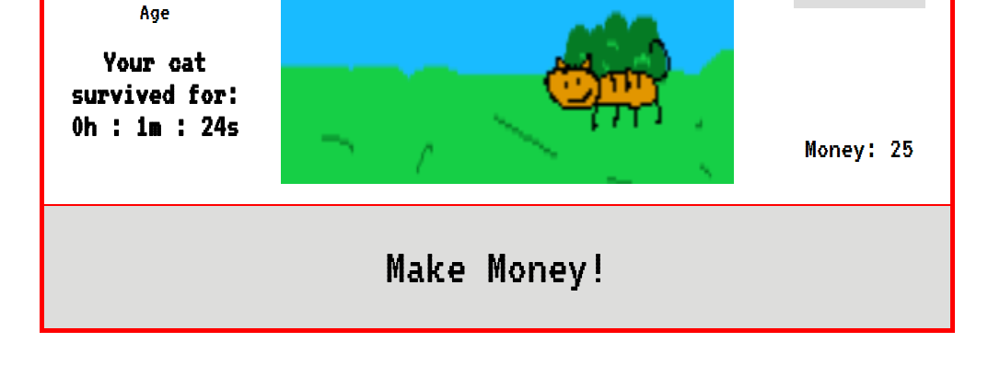
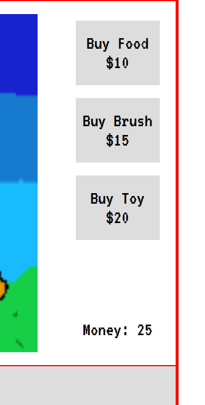
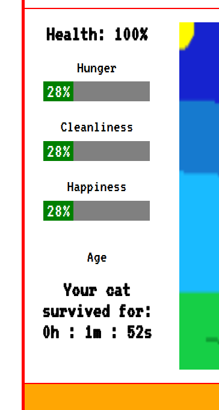
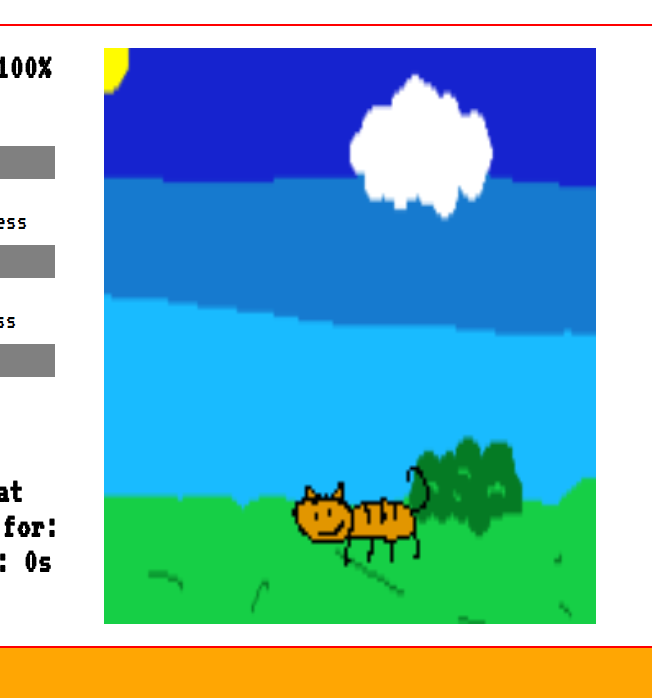

# CatClicker

[CatClicker](https://mike591.github.io/CatClicker/) is a silly game where you take care of a virtual cat.

## Features & Implementation

### Click to make money

Players earn money by continuously clicking the make money button.

### Game store

The game store keeps track of how money the player has and allows the player to purchase items for the cat.

### Cat status

The status bar displays your cat's health and current needs. The needs decrease as time passes.

### Display

The game has a display that shows an animation of the cat. Buying items will show up in the display and will be used by the cat.

## Future Directions for the Project

Given more time, I would like to implement the following:

### More Animations

The Cat will have a variety of animations instead of simply pacing back and forth.

### More personalization

Players can name the cat and there will be several texts that appears at random (ex: Mittens loves you!) to keep the player invested in the game.
