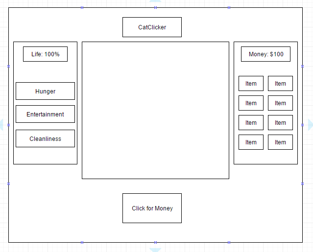

## CatClicker

### Background

The goal of this game is to keep your cat alive for as long as possible! You achieve this by clicking a button to make money and then using the money to buy necessities for your cat.

### Functionality & MVP  

In CatClicker, you will be able to:

- [ ] Click to make money and be able to see your current amount + current score.
- [ ] See your cat in the central container.
- [ ] Purchase items and be able to place the item on the grid. The cat should move to the item.
- [ ] Have a cat status container that displays the cat's health and needs.
- [ ] A production Readme

### Wireframes

The app will have one large board to house the game. Within that, there will be a cat status container, a display container and a store container. At the very top, is the game title and at the very bottom will be a button for making money.

### Architecture and Technologies

This project will be implemented with the following technologies:

- Vanilla JavaScript for overall structure and game logic,
- HTML5 Canvas for DOM manipulation and rendering,
- Webpack to bundle and serve up the various scripts.

In addition to the webpack entry file, there will be these scripts involved in this project:

`catclicker.js`,
`game.js`,
`store.js`,
`cat.js`
### Implementation Timeline

**Day 1**: Setup all necessary Node modules, including getting webpack up and running and `Easel.js` installed.  Create `webpack.config.js` as well as `package.json`.  Write a basic entry file. Get the game state and button up. Create the store (the right-most panel). Make sure the money display is up. Allow purchasing of items in the store.

**Day 2**: Set up the status bar (the left-most panel). Have needs degrade slowly. When any needs are below 0%, life percentage will degrade. Have a current score display.

**Day 3**: Add cat to the display (the central panel). Have cat move around in the canvas. When buying items, have item fall into the display. Have cat 'interact' with item and update respective needs.

**Day 4**: Clean and style project.

### Bonus features

If given the time, I would try to implement these features:

- [ ] Penalties for overfeeding.
- [ ] Being able to save and be able to keep track of high scores.
- [ ] More animations.
